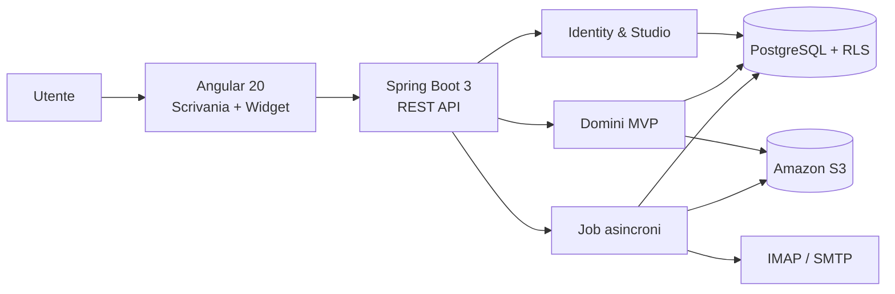

# FORO — Architecture

**Versione:** 3.0  
**Stato:** baseline architetturale

## 1. Stack vincolante

| Layer | Tecnologia |
|---|---|
| Frontend | Angular 20, Angular Material, Gridster, TailwindCSS |
| Backend | Spring Boot 3, Spring Security, JWT, REST API |
| Database | PostgreSQL |
| Object storage | Amazon S3 |
| Packaging | Docker |
| Cloud | AWS |

## 2. Stile architetturale

Il MVP usa un **monolite modulare**: un solo deploy backend, con confini di dominio espliciti. Microservizi non sono ammessi senza ADR e prova di necessità operativa.

Principi:

- API-first;
- tenant-aware end-to-end;
- servizi backend stateless;
- operazioni lente asincrone;
- idempotenza per sincronizzazioni e comandi a rischio duplicazione;
- storage a oggetti immutabile per versione;
- osservabilità e audit come capacità trasversali.

## 3. Vista logica

## 4. Confini di dominio

| Area | Responsabilità |
|---|---|
| Identity & Studio | autenticazione, membership, ruoli, branding |
| Workspace | catalogo widget, layout, configurazioni |
| Clients | anagrafiche, contatti, privacy, duplicati |
| Matters | Pratica/Fascicolo, collaboratori, timeline |
| Calendar | calendari, eventi, ricorrenze, promemoria |
| Documents | metadata, versioni, template, preview, S3 |
| Email | account, sync, messaggi, invii, associazioni |
| Platform | audit, job, notifiche, osservabilità |

Le dipendenze circolari tra aree sono vietate. Le integrazioni avvengono tramite servizi applicativi o eventi interni tipizzati.

## 5. Multi-tenancy

Strategia MVP:

- database condiviso;
- schema condiviso;
- `studio_id` obbligatorio su ogni entità tenant-owned;
- contesto tenant derivato dall’identità autenticata;
- PostgreSQL Row-Level Security come difesa addizionale;
- prefissi S3 segregati per tenant.

### Invarianti

- il client non è autorità per `studio_id`;
- una relazione cross-tenant deve fallire a livello applicativo e dati;
- una risorsa di altro tenant risponde come non trovata;
- un tentativo cross-tenant genera evento di sicurezza;
- cache e job includono sempre il tenant;
- cambio Studio o logout svuota cache e stato locale.

## 6. Autenticazione e autorizzazione

- access token JWT breve;
- refresh token ruotato e revocabile;
- MFA disponibile per tutti e obbligatoria per ruoli privilegiati;
- autorizzazione composta da tenant, membership, feature, azione e perimetro oggetto;
- deny-by-default;
- pratica riservata governata da ACL esplicita;
- backend sempre autorevole: nascondere un bottone non è autorizzazione.

## 7. Storage documentale

1. frontend richiede una sessione upload;
2. backend verifica permesso, quota e metadati;
3. browser carica in area temporanea S3 tramite URL firmato;
4. job verifica dimensione, checksum, MIME e sicurezza;
5. backend finalizza la versione o pone il file in quarantena;
6. upload non finalizzati vengono rimossi dopo TTL.

Gli oggetti non sono pubblici. Download e preview usano URL firmati brevi.

## 8. Asincronia

Sono asincroni:

- sincronizzazione email;
- invio email;
- scansione file;
- conversione preview;
- generazione PDF;
- promemoria;
- cleanup e riconciliazione.

Ogni job contiene:

- tenant ID;
- correlation ID;
- actor tecnico o utente originatore;
- idempotency key;
- tentativo corrente;
- stato e causa ultimo errore.

## 9. Deployment AWS

Ambienti separati:

- development;
- staging;
- production.

Requisiti:

- container Docker immutabili;
- segreti in servizio dedicato, mai in repository;
- database e bucket separati almeno per ambiente;
- TLS terminato su componente gestito;
- log e metriche centralizzati;
- backup automatici e restore testato;
- infrastruttura riproducibile;
- deploy con rollback.

La scelta puntuale dei servizi AWS deve essere documentata con ADR prima dell’implementazione infrastrutturale.

## 10. Requisiti non funzionali

| Area | Obiettivo |
|---|---|
| Disponibilità | 99,5% mensile MVP |
| RPO | ≤ 24 ore |
| RTO | ≤ 4 ore |
| Dashboard | shell interattiva ≤ 2 s p75 |
| Widget principali | contenuto ≤ 3 s p75 |
| API core | letture ≤ 500 ms p95, escluse terze parti |
| Concorrenza | ≥ 50 utenti concorrenti per Studio |
| Audit | operazioni sensibili tracciate |
| Accessibilità | WCAG 2.2 AA target |

## 11. Failure isolation

- ogni widget possiede loading, empty, partial error, error e forbidden;
- il fallimento email non blocca clienti o calendario;
- una dipendenza esterna degradata mostra ultimo sync e retry;
- un invio incerto non viene ripetuto automaticamente;
- file non verificati restano in quarantena;
- dati stale sono marcati esplicitamente.

## 12. Decisioni da non anticipare

Non scegliere senza ADR:

- Kubernetes;
- microservizi;
- provider di conversione DOCX/PDF;
- broker di messaggi;
- motore di ricerca full-text;
- provider OAuth email;
- provider AI;
- provider firma/PCT.

