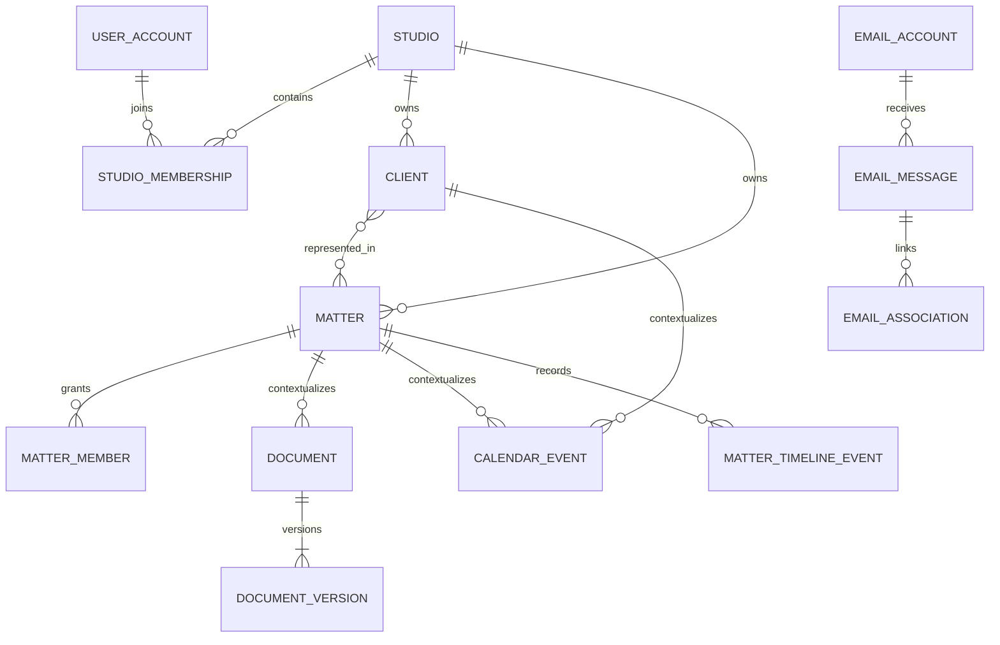

# FORO — Database Specification

**Versione:** 3.0  
**Database:** PostgreSQL

## 1. Convenzioni

- tabelle e colonne in `snake_case`;
- chiavi primarie UUID;
- timestamp `timestamptz` in UTC;
- date civili come `date`;
- importi come `numeric`, mai floating point;
- enum applicativi come check constraint o lookup versionato;
- `studio_id NOT NULL` sulle entità tenant-owned;
- `version` per optimistic locking;
- `created_at`, `created_by`, `updated_at`, `updated_by`;
- `deleted_at` solo dove la cancellazione logica è prevista.

## 2. Entità MVP

| Gruppo | Entità |
|---|---|
| Studio | `studio`, `studio_branding`, `studio_join_code` |
| Identity | `user_account`, `studio_membership`, `access_request`, `role`, `permission`, join tables |
| Workspace | `dashboard_layout`, `widget_instance`, `widget_config` |
| Clienti | `client`, `client_contact`, `client_address`, `privacy_record`, `client_merge_event` |
| Pratiche | `matter`, `matter_client`, `matter_member`, `matter_counterparty`, `matter_timeline_event` |
| Calendario | `calendar`, `calendar_visibility`, `calendar_event`, `event_participant`, `event_reminder`, `recurrence_rule` |
| Documenti | `document`, `document_version`, `document_tag`, `folder`, `template`, `template_version`, `generation_event` |
| Email | `email_account`, `email_folder`, `email_message`, `email_recipient`, `email_attachment`, `email_association`, `sync_checkpoint`, `outbox_item` |
| Platform | `audit_event`, `background_job`, `notification`, `security_event` |

## 3. Relazioni chiave

## 4. Integrità tenant

- FK tenant-aware ove possibile: `(studio_id, id)`;
- indici iniziano con `studio_id` per query tenant-scoped;
- RLS attiva su tutte le tabelle tenant-owned;
- session variable/database context impostato in transazione;
- service account senza bypass RLS, eccetto processi amministrativi segregati;
- test automatico per ogni repository: record di Studio B invisibile a Studio A.

## 5. Vincoli essenziali

### Studio e membership

- un membership attivo per coppia utente/Studio;
- join code memorizzato come hash;
- join code con scadenza, revoca e limite d’uso;
- richiesta accesso unica nello stato pendente.

### Cliente

- tipo `PERSON` o `ORGANIZATION`;
- nome/denominazione obbligatorio secondo tipo;
- CF/P.IVA normalizzati;
- unicità forte solo se la policy lo consente; altrimenti duplicate candidate;
- contatto primario unico per tipo.

### Pratica

- codice pratica univoco nello Studio;
- almeno un cliente;
- stato ammesso: `DRAFT`, `OPEN`, `SUSPENDED`, `CLOSED`, `ARCHIVED`;
- chiusura richiede data e motivazione;
- riservatezza `STANDARD` o `RESTRICTED`;
- Pratica e Fascicolo condividono lo stesso record.

### Documento

- `document` rappresenta identità logica;
- `document_version.version_number` progressivo e univoco;
- S3 key immutabile;
- checksum SHA-256;
- stato `PENDING`, `CLEAN`, `QUARANTINED`, `ARCHIVED`;
- template version pubblicata immutabile.

### Email

- `email_account + message_id` univoco quando presente;
- fallback content hash;
- outbox con idempotency key unica;
- association con `source`, `confidence`, `reason`, `confirmed_by`;
- segreti non presenti nelle tabelle applicative in chiaro.

## 6. Timeline

`matter_timeline_event` è append-only e contiene:

- tipo evento;
- riferimento sorgente;
- timestamp evento;
- actor;
- payload sintetico versionato;
- livello di visibilità.

La timeline non duplica il contenuto integrale di documenti o email.

## 7. Indicizzazione

Indici minimi:

- `(studio_id, status)` per clienti/pratiche;
- `(studio_id, updated_at DESC)`;
- eventi su `(studio_id, start_at, end_at)`;
- documenti su `(studio_id, matter_id, updated_at DESC)`;
- email su `(studio_id, account_id, received_at DESC)`;
- timeline su `(studio_id, matter_id, occurred_at DESC)`;
- GIN/trigram solo dopo misura e ADR.

## 8. Retention e cancellazione

| Dato | Strategia |
|---|---|
| Clienti/pratiche | cancellazione logica; legal hold |
| Documenti | versioni preservate; purge autorizzato |
| Email | policy configurabile e vincoli professionali |
| Audit | append-only; retention definita con DPO |
| Job tecnici | retention breve dopo esito |
| Join code/token | scadenza e purge |

I tempi definitivi sono una decisione legale/organizzativa aperta.

## 9. Migrazioni

- strumento di migration unico e versionato;
- nessuna modifica manuale in produzione;
- migration backward-compatible per deploy graduali;
- backfill separato per operazioni lunghe;
- rollback documentato o forward-fix;
- test migration da snapshot anonimizzato;
- backup verificato prima di migrazioni ad alto rischio.

## 10. Dati vietati nei log

- password e token;
- credenziali IMAP/SMTP;
- corpi email;
- contenuto documenti;
- dati giudiziari non necessari;
- URL firmati S3;
- codici Studio in chiaro;
- dati completi di pagamento futuri.

